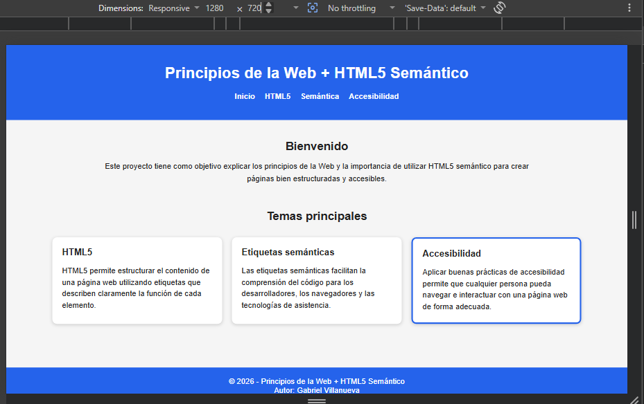
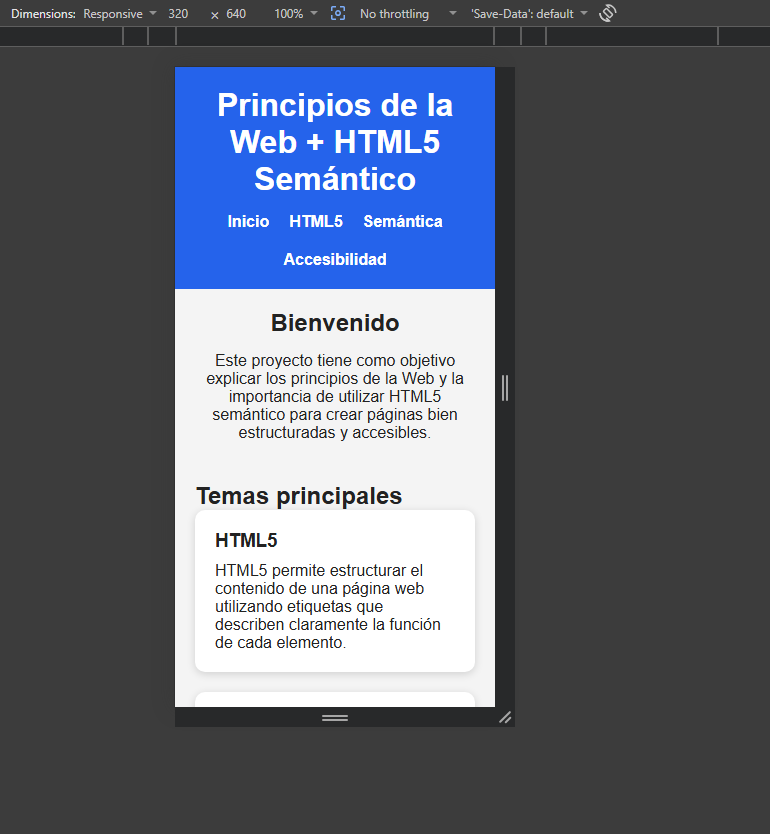

# Proyecto Integrador HTML y CSS

## Información del estudiante

- **Nombre:** Gabriel Villanueva
- **Carné:** 0905-23-21427

---
## Nombre del proyecto

**Principios de la Web + HTML5 Semántico**

Este proyecto tiene como objetivo aplicar los conocimientos adquiridos sobre HTML5 semántico y CSS, utilizando una estructura organizada, accesible y responsive.

---

## Tecnologías utilizadas

- HTML5
- CSS3
- CSS Grid
- Flexbox
- Responsive Design (Mobile First)

---

## Estructura del proyecto

```text
proyecto-integrador-html
│
├── index.html
├── styles.css
├── README.md
└── capturas/
    ├── responsive 320.png
    └── responsive 1280.png
```

---

## Capturas del proyecto

### Vista móvil (320 px)



### Vista escritorio (1280 px)



---

